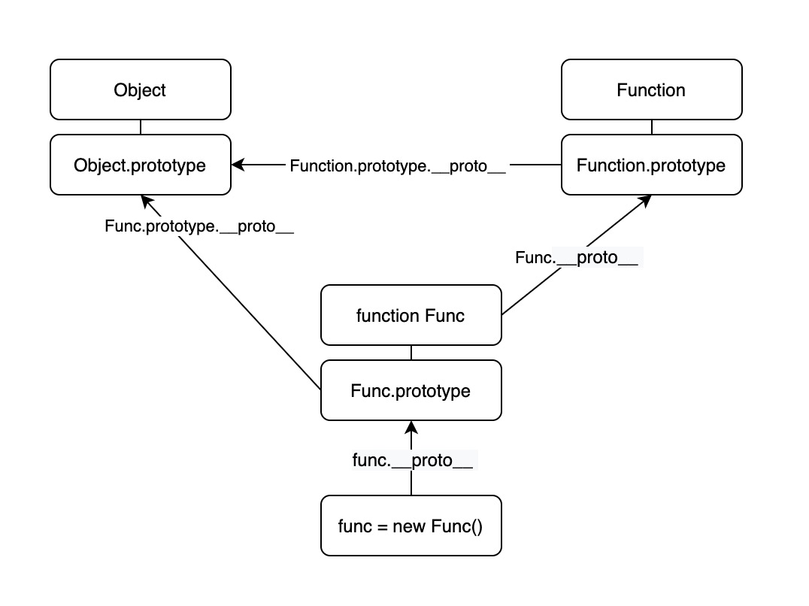

# 知识点杂记

#### 函数和类也是对象

```javascript
function func() {};
func.a = 100;
```

*\*在react组件中可利用这点*

```javascript
function Layout() {
    return <div>Layout</div>;
}

Layout.Header = function() {
    return <div>Header</div>;
}

Layout.Sidebar = function() {
    return <div>Siderbar</div>;
}

Layout.Content = function() {
    return <div>Content</div>;
}
```

#### number

- **e(n)代表10^n**

```
1e2 = 10^2
2e3 = 2*(10^3)
```

- **可用 _ 进行分割**

```javascript
const num = 12_34; // 1234
```

- **非0数除以0不是错误，而是为Infinity**

```javascript
(10 / 0) === Infinity; // true
Number.isNaN(0 / 0); // true
```

- **0等于-0，但Infinity不等于-Infinity**

```javascript
0 === -0; // true
1 / 0 === 1 / -0 // false
Infinity === -Infinity // false
```

- **浮点数精度丢失问题**

本质原因是二进制表示浮点数问题

参考文档: <https://zhuanlan.zhihu.com/p/269619376>

#### Symbol

```javascript
const a1 = Symbol();
const b1 = Symbol();
a1 === b1; // false

const a2 = Symbol.for("example");
const b2 = Symbol.for("example");
a2 === b2; // true
Symbol.keyFor(a2); // "example"
```

#### 解构赋值

```javascript
const [x, ...rest] = [1, 2, 3, 4]; // rest = [2, 3, 4]

const [value, setValue] = useState();
```

#### 条件式属性访问及条件式调用

```javascript
const a = {};
a?.b; // => undefined
a?.b.c.d; // => undefined

const a1 = { b: {} };
a1.b?.c?.d; // => undefined

// 条件式调用
function test(func) {
    let x = 1;
    func?.(x++); // func && func(x++)
    return x; // 因为短路问题x++不会执行 x=0
}
```

#### 先定义(??)

```javascript
const a = b || 100; // 这种写法的问题在于0、false、""都为假值
// 改写为
const a = b ?? 100;
```

#### void操作符
```javascript
// void先求值自己的操作数，后丢弃自己的操作数
const voidTest = (count) => void count++;
voidTest(1); // undefined
```

#### 数组

1. Array()

```
当使用 new Array() 创建数组时，一个参数表达数组长度，多个参数表示具体元素，故这种方式无法创建一个元素的数组
```

2. Array.of()

```javascript
// 以参数作为数组元素，解决上面问题
Array.of(10); // [10]
```

3. 稀疏数组

```javascript
const arr1 = [1,,3];
const arr2 = [,]; // arr2.length = 1
```

4. 数组打平

```javascript
[1, [2, 3]].flat(); // [1, 2, 3]
[1, [2, [3]]].flat(); // [1, 2, [3]]
[1, [2, [3]]].flat(2); // [1, 2, 3]
[1, [2, [3]]].flat(3); // [1, 2, 3]

// flatMap(f)效率高于map(f)
[1, [2, [3]]].flatMap((n) => n); // [1, 2, [3]]
```

5. copyWithin(target, start, end)

```javascript
/*
* 复制指定切片到指定位置，修改原数组但不会改变数组长度，切片溢出部分会被丢弃
* 切片为<start - (end -1)>
* end 支持负数
*/
[6, 2, 3, 4, 5, 7].copyWithin(3, 2, 5); // [6, 2, 3, 3, 4, 5]
```

#### 原型和原型链



```
1. prototype
显式原型，函数对象独有属性，箭头函数没有

2. __proto__
隐式原型，几乎所有对象都有，指向它的构造函数的原型对象，所形成的的链式指向便是原型链
```

- __示例1__

```javascript
const a = {};
a.__proto__.show = function () { return 123 };
const b = {};
b.show(); // 123
```

- __示例2__

```javascript
const a = {};
Object.prototype === a.__proto__; // true
Object.prototype === Object.prototype.constructor.prototype; // true
```

- __示例3__

```javascript
class A {};
const a = new A();
a.__proto__ === A.prototype; // true
a.__proto__.__proto__ === A.prototype.__proto__; // true
A.prototype.__proto__ === Object.prototype; // true
A.__proto__ === Function.prototype; // true
Function.prototype.__proto__ === Object.prototype; // true
Object.prototype.__proto__; // null
```

- __示例4__

```javascript
const a = {};
Object.prototype.toString.call(a) === a.__proto__.toString(); // true
```


#### 生成器

```javascript
function* generator() {
    yield 1;
    yield 2;
    yield 3;
}
    
// 斐波那契数
function* fibonacci() {
    let x = 0, y = 1;
    for (;;) {
        yield y;
        [x, y] = [y, x + y];
    }
}
```
