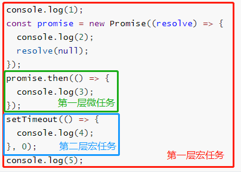
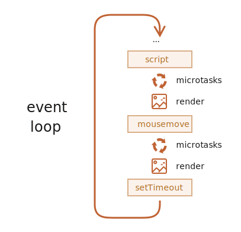

# 事件循环（Event Loop）

JavaScript的核心特征便是单线程，其根本原因是对于DOM的操作， 即便出现了对此现状的解决方案（如: web worker），但不会允许子线程对于DOM的操作。

JavaScript有一个基于 **事件循环** 的并发模型，事件循环负责执行代码、收集和处理事件以及执行队列中的子任务。

JavaScript中的任务被分为同步任务和异步任务，同步任务是在主线程中排队执行，异步任务会被放置进任务队列（task queue）中：

```javascript
console.log(1);
setTimeout(() => {
  console.log(2);
}, 0);
console.log(3);
```

上面的运行结果为 1 3 2 ，可以看到 setTimeout 的延时为 0ms ，说明异步任务一定是在当前 **帧** 的同步任务全部执行完才开始执行。

在任务队列中又被分为宏任务和微任务，在同一帧下宏任务是先于微任务执行的：

```javascript
console.log(1);
const promise = new Promise((resolve) => {
  console.log(2);
  resolve(null);
});
promise.then(() => {
  console.log(3);
});
setTimeout(() => {
  console.log(4);
}, 0);
console.log(5);
```

上面的代码执行结果为 1 2 5 3 4 ，这边比较容易迷惑的点是上面说宏任务先于微任务执行，但为什么这边的 Promise.then 微任务会先于 setTimeout 宏任务执行。这边我们做一个任务拆分就很容易理解了：



1. 首先整个script属于第一层宏任务
2. 第一层宏任务执行时遇到微任务将其放入微任务队列
3. 第一层宏任务执行时遇到宏任务将其放入宏任务队列
4. 第一层宏任务执行完毕开始执行所有微任务
5. 第一层所有微任务执行完毕开始执行第二层宏任务

#### 宏任务（Macro Task）

- script(整体代码)
- setTimeout
- setInterval
- UI 渲染
- I/O
- postMessage
- MessageChannel
- setImmediate(Node.js 环境)

#### 微任务（Micro Task）

- Promise
- MutaionObserver
- process.nextTick(Node.js 环境）


