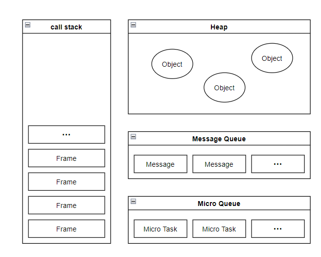
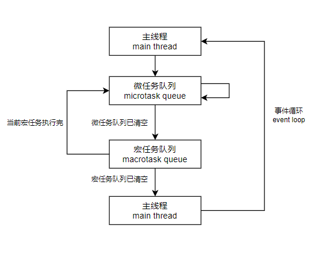

# 事件循环（Event Loop）

依 MDN 所说：

**"JavaScript有一个基于事件循环的并发模型，事件循环负责执行代码、收集和处理事件以及执行队列中的子任务。"**

本篇文章与其说是详细讲解这个过程，不如讲是具体论证这个机制的过程。

首先要了解 JavaScript 的核心特征是单线程，其根本原因是对于DOM的操作， 即便出现了对此现状的解决方案（如: web worker），但不会允许子线程对于DOM的操作。

既然是单线程，那在执行任务时很容易因为某些任务需要延时或者等待而造成线程阻塞，为了解决这类问题就需要一种机制或者解决方案去统一管理这些任务，把这些任务暂时挂起，等到它们有返回结果了再去执行，也就是所谓的**事件循环**。



上图是一个大致模型图，调用栈（call stack）里存储了若干帧（frame），消息队列（message queue）和微任务队列（microtask queue）用来存放回调（callback），举个简单的例子：

```javascript
function func1() {
  console.log(1); // 步骤6
}

function func2() {
  console.log(2); // 步骤2

  const pm = new Promise((resolve) => {
    console.log(3); // 步骤3
    resolve(4);
  });

  setTimeout(() => { // 步骤4
    console.log(5); // 步骤9
  });

  pm.then((resolved) => { // 步骤5
    console.log(resolved); // 步骤8
  }).then(() => {
    console.log(6); // 步骤8
  });

  func1(); // 步骤6

  console.log(7); // 步骤7
}

func2(); // 步骤1
```

结果打印顺序为 2 3 1 7 4 6 5 ，下面做一个步骤拆分：

1. 调用 *func2* ，将 *func2* 压入栈中并执行
2. 将 *console.log* 压入栈中并执行，执行完出栈，输出 2
3. 将 *new Promise* 压入栈中，执行 **步骤2** 并出栈，输出 3
4. 将 *setTimeout* 压入栈中，将其回调函数加入消息队列并出栈，此时消息队
5. 将 *promise.then* 压入栈中，将其回调函数顺序加入微任务队列并出栈
6. 将 *func1* 压入栈中，执行 **步骤2** 并出栈，输出 1
7. 执行 **步骤2**，输出 7
8. 顺序执行微任务队列中的回调，输出 4 6
9. 顺序执行消息队列中的回调，输出 5

之所以这样解释是因为片面的去谈论宏任务和微任务的执行顺序会造成一定的困扰。

```javascript
const pm = new Promise((resolve) => {
  console.log(1);
  resolve(null);
});

pm.then(() => {
  console.log(2);
  new Promise((resolve) => {
    console.log(3);
    resolve(null);
  }).then(() => {
    console.log(4);
  });

  setTimeout(() => {
    console.log(5);
  });

  console.log(6);
});

setTimeout(() => {
  console.log(7);

  new Promise((resolve) => {
    console.log(8);
    resolve(null);
  }).then(() => {
    console.log(9);
  });

  console.log(10);
});
// 1 2 3 6 4 7 8 10 9 5
```

上面这段代码会发现一个很有意思的现象，在微任务里创建微任务会被顺序执行，但是创建的宏任务并不会去执行，而在宏任务里创建的微任务会先于宏任务被执行后再继续顺序执行下面的宏任务。由此可见事件循环中微任务的优先级是高于宏任务的。所以片面的说当前帧（此处的帧不是渲染帧，而是调用帧）下，谁先执行是不严谨的。

此时再去看事件循环就简单的多了：

<div></div>

#### 宏任务（Macro Task）

- script
- setTimeout
- setInterval
- UI 渲染
- I/O
- postMessage
- MessageChannel
- setImmediate(Node.js 环境)

#### 微任务（Micro Task）

- Promise
- MutaionObserver
- process.nextTick(Node.js 环境）